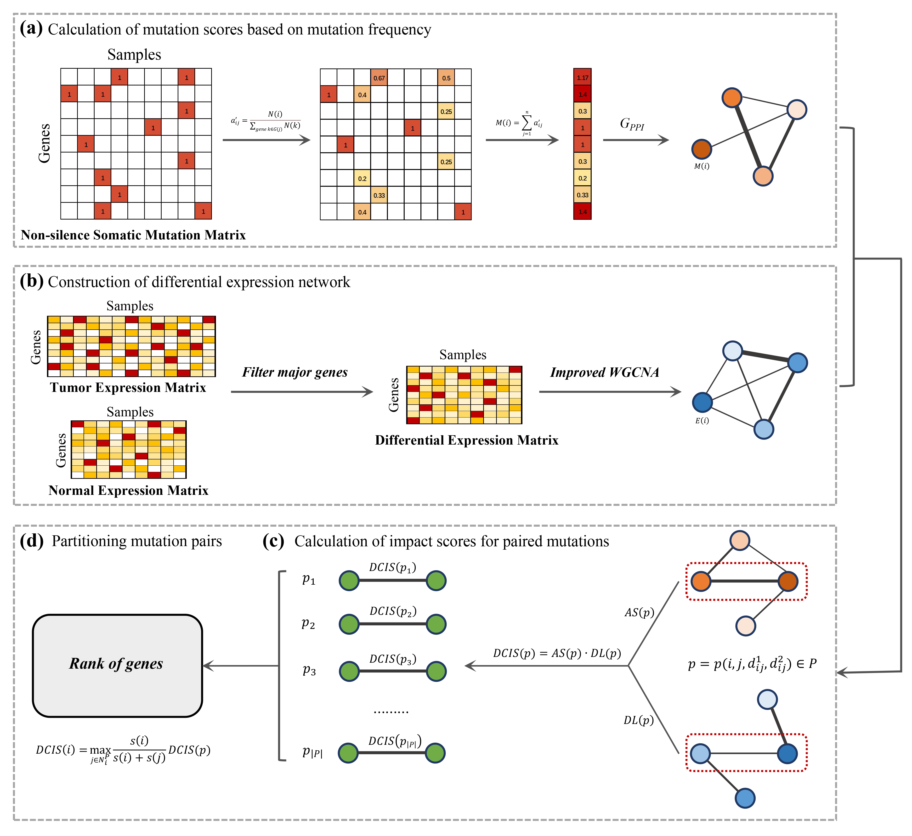

# DriverMP

Here, we present a new method termed DriverMP (Multiomics-based Pair driver genes) for effectively prioritizing altered genes on a cancer type level by considering mutation pair genes. It is designed by first applying somatic mutation data, protein-protein interaction network, and differential gene expression data to prioritizing mutation pairs, based on which individual mutated genes are then prioritized.

The workflow of DriverMP is as follows.

## Requirements for installation

**1.** `Linux/Unix` environment

**2.** `C++` is one of the program languages, which is available for most operating systems. If you are in UNIX/Linux, it is probably already installed;

**3.** We tested the code on `Ubuntu 18.04.6 LTS`, using `g++ version 7.5.0`, and we recommend that you use DriverMP on that version or above. If you want to check your current version of g++, you can use the following command in your terminal:

`g++ --version`

## Installation

**1.** Unzip "DriverMP-master.zip" you have downloaded:

`$ unzip DriverMP-master.zip -d DriverMP`

**2.** Then enter the DriverMP folder：

`$ cd DriverMP`

**2.** You can compile the code we provide as follows (The prerequisite is that you have the openMP installed)：

`g++ -Ofast -fopenmp *.cpp -o DriverMP`

Then, you can be freely to use DriverMP. If you cannot execute it, you can try to change the permissions of the file:

`g++ -Ofast -fopenmp *.cpp -o DriverMP`

## Usage of DriverMP
		
<<<<<<< HEAD
    DriverMP [options] -m <mutation_file> -t <tumor_expression_file> -n <normal_expression_file> -p <PPI_network_file>

**Required**

    --mut/-m <string>            : Path to format-compliant non-silent somatic mutation data;
=======
    ./DriverMP [options] -m <mutation_file> -u <tumor_expression_file> -n <normal_expression_file> -p <PPI_network_file>

**Required**

    --mut/-m <string>            : Path to non-silent somatic mutation data;

    --tumor_exp/-u <string>      : Path to gene expression data (FPKM normalized) for specific cancer samples;
>>>>>>> 20e88dc2c99917e4bfef2f44604e667368a90ad6

    --tumor_exp/-u <string>      : Path to RNA-Seq data (FPKM normalized) for specific cancer samples;

    --normal_exp/-n <string>     : Path to RNA-Seq data (FPKM normalized) of normal samples corresponding to the specific cancer;

    --ppi/-p <string>            : Path to Protein-Protein Interaction Networks.

**Optional**

    --threads/-t <int>           : Number of threads to launch, default: 1;

    --version/-v                 : Show current version of DriverMP;

    --help/-h                    : help infomation;

**Typical commands**

A example of DriverMP  might be:

<<<<<<< HEAD
    ./DriverMP -m DriverMP_example//Mutation_data.txt -u DriverMP_example//Gene_expresstion_tumor.txt -n DriverMP_example//Gene_expression_normal.txt -p DriverMP_example//HumanNet
	
## Data Format Requirements
=======
    ./DriverMP -m DriverMP_example/Mutation_data.txt -u DriverMP_example/Gene_expresstion_tumor.txt -n DriverMP_example/Gene_expression_normal.txt -p DriverMP_example/HumanNet
    
or
    
    ./DriverMP --mut DriverMP_example/Mutation_data.txt --tumor_exp DriverMP_example/Gene_expresstion_tumor.txt --normal_exp DriverMP_example/Gene_expression_normal.txt --ppi DriverMP_example/HumanNet

**Output**

The result is saved in Output/output.txt.
>>>>>>> 20e88dc2c99917e4bfef2f44604e667368a90ad6

**Changelog**

The current version of DriverMP is 1.0, subsequnt version will be updated.
 
## Data Format Requirements

**A.** Mutation Data

(i) Note that only genes with `Official Symbol` can be recognised, such as BRCA1, IGF1R;

(ii) The first row is the sample ID, and the first element of each row starting from the second row is the gene of form Official Symbol.

The format requirement is as follows:

    [sample 1] tab [sample 2] tab [sample 3] tab … tab [sample M]

    [ Gene  A] tab [ 0 or 1 ] tab [ 0 or 1 ] tab … tab [ 0 or 1 ]

    [ Gene  B] tab [ 0 or 1 ] tab [ 0 or 1 ] tab … tab [ 0 or 1 ]

    ...
	    
    [ Gene  C] tab [ 0 or 1 ] tab [ 0 or 1 ] tab … tab [ 0 or 1 ]

**B.** Gene Expression RNA-Seq Data

(i) Note that only genes with `Official Symbol` can be recognised, such as BRCA1, IGF1R;

(ii) The first row is the sample ID, and the first element of each row starting from the second row is the gene of form Official Symbol;

<<<<<<< HEAD
(iii) We use RNA-Seq data downloaded in FPKM format in TCGA, and we recommend that you use this format as well;

(iv) You need to provide both `Tumor and normal` RNA-Seq data, please make sure they both conform to the format.
=======
(iii) We use gene expression data downloaded in FPKM format in TCGA database, and we recommend that you use this format as well;

(iv) You need to provide both `Tumor and normal` gene expression data, please make sure they both conform to the reformat.
>>>>>>> 20e88dc2c99917e4bfef2f44604e667368a90ad6

The format requirement is as follows:

    [sample 1] tab [sample 2] tab [sample 3] tab … tab [sample M]

    [ Gene  A] tab [  value ] tab [  value ] tab … tab [  value ]

    [ Gene  B] tab [  value ] tab [  value ] tab … tab [  value ]

    ...
	    
    [ Gene  C] tab [  value ] tab [  value ] tab … tab [  value ]

**C.** Protein-Protein Interaction Network

<<<<<<< HEAD
(i) DriverMP provides two default PPI networks HumanNet and STRINGv10, if you need to use other PPI networks please provide formatted data.

(ii) At present, the node naming method of PPI network is generally in NCBI format. For your convenience, we have built-in conversion of genes' names, and you can directly provide the downloaded PPI network to DriverMP.

(iii) For the best performance of DriverMP, you should preferably provide PPI networks with weights that are maximum-minimum normalized as follows: 
=======
(i) At present, the node (or gene/protein) naming method of PPI network is generally in NCBI format. For your convenience, we have built-in conversion of genes' names, and you can directly provide the downloaded PPI network to DriverMP.

(ii) For the best performance of DriverMP, you should preferably provide a PPI network with weights that are maximum-minimum normalized as follows: 
>>>>>>> 20e88dc2c99917e4bfef2f44604e667368a90ad6

$$
x^{'} = \frac{x - \min {x}}{\max {x} - \min {x}}
$$
		
<<<<<<< HEAD
The data format requirements are as follow: 
			
**[Gene NCBI A]** tab **[Gene NCBI ID B]** tab [the weight between Gene A and B]
=======
The data format requirement is as follows: 
			
    [Gene NCBI A] tab [Gene NCBI ID B] tab [the weight between Gene A and Gene B]
>>>>>>> 20e88dc2c99917e4bfef2f44604e667368a90ad6

    ...

<<<<<<< HEAD
**[Gene NCBI C]** tab **[Gene NCBI D]** tab [the weight between Gene C and D]
=======
    [Gene NCBI C] tab [Gene NCBI ID D] tab [the weight between Gene C and Gene D]
>>>>>>> 20e88dc2c99917e4bfef2f44604e667368a90ad6
